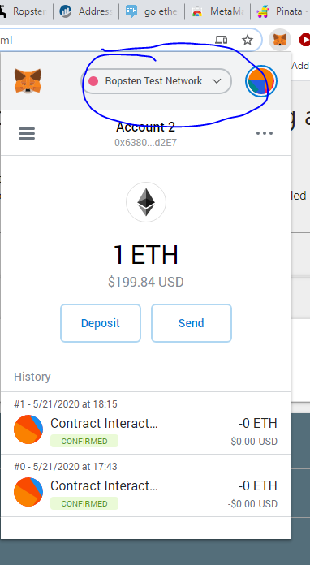
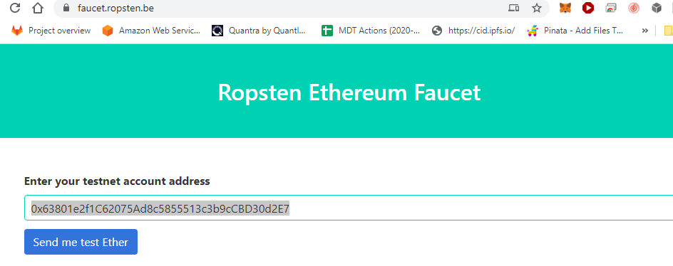
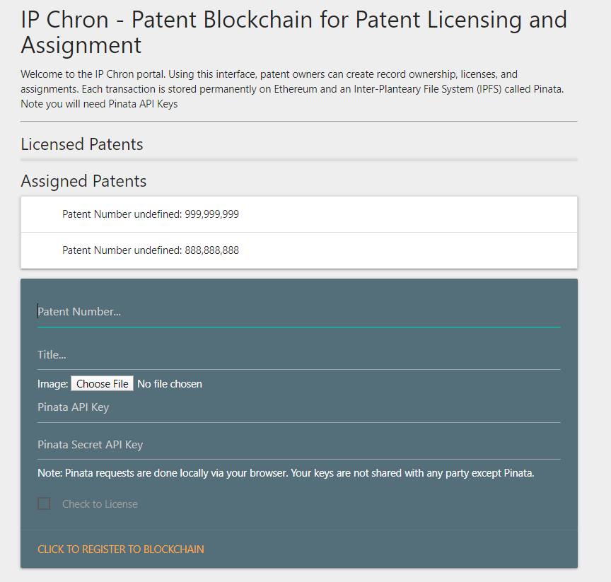
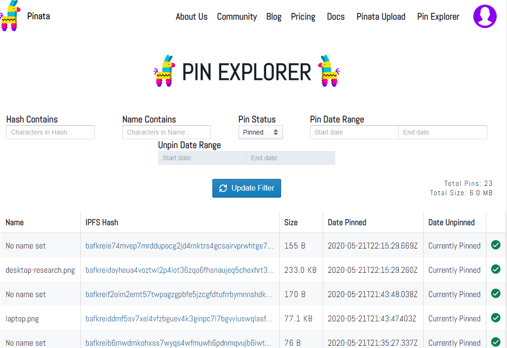

# IPChron Patent Blockchain
By Roger C. Hahn

Welcome to the world's first blockchain ledger to record and track patent grants, assignments, and licenses. If you want to jump straight to the dApp, [click here](https://rhahn28.github.io/Patent_Blockchain/frontend/index.html). This webpage allows you to interact with the dApp in your browser and record transactions on the blockchain.

## Summary
This dApp (distributed application) is a patent rights management smart contract built on the Ethereum blockchain. Users can add a new patent asset onto the Ethereum blockchain and record assignments and licenses during the life-cycle of the patent from grant to expiration. The smart contract is live on the Ropsten Testnet Ethereum Network at hash 0xA300cDC8b672EED8Ce3413D6714D39BEd9241260. Navigate to this [page](https://ropsten.etherscan.io/address/0xa300cdc8b672eed8ce3413d6714d39bed9241260) to explore the transactions performed by the smart contract on Ropsten Etherscan.

## Instructions 
To record your patent and transact on this chain, please install Metamask and make sure MetaMask is on the Ropsten Test Network.

### Metamask
Install Metamask to your Chrome browser [here](https://chrome.google.com/webstore/detail/metamask/nkbihfbeogaeaoehlefnkodbefgpgknn?hl=en). Metamask allows you to "talk" to the Ethereum network.

### Ropsten Test Network
The smart contract is deployed on Ropsten, so you will need to get free test ETH [here](https://faucet.ropsten.be/). This test ETH will be spent as "gas" to allow you to conduct transactions on the chain. Make sure to use a valid address that will receive the test ETH as shown below. If you don't have an address or wallet, you can get one from [MyCrypto](https://mycrypto.com/account)

### IPFS
To store files on-chain in an immutable and tamper-proof form for all time, we will use the Inter-Planetary File System using [Pinata.cloud](https://pinata.cloud/). Register on Pinata, and get your API keys from your Account profile. You will need those to upload files. Note that there is no restriction on file type. The filetypes can be .pdf, .doc, .xls, .jpg, basically any file that can be hashed from bytecode. Size limit is currently 1 gigabyte.

### Recording transactions
To record transactions to create an immutable record on the blockchain, [Click here](https://rhahn28.github.io/Patent_Blockchain/frontend/index.html) and enter in your patent data. Once you've entered in your patent data and API keys, click "Register To Blockchain" and wait for your transaction to be mined by the Ethereum Virtual Machine. 

View on etherscan [here](https://ropsten.etherscan.io/address/0xa300cdc8b672eed8ce3413d6714d39bed9241260). Be patient, it may take a minute or two to mine.

### Viewing on IPFS
If you want to view your uploaded files, go to [Pinata Explorer](https://pinata.cloud/pinexplorer) in your account and click the hash. 

You're done! You now have a tamper-proof, immutable record of all your patent transactions on an auditable blockchain for all-time. Congratulations!

Roger C. Hahn ©

rhahn@temburi.com
